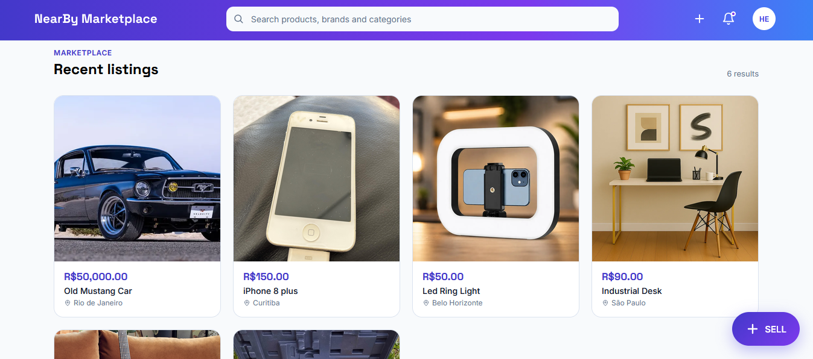
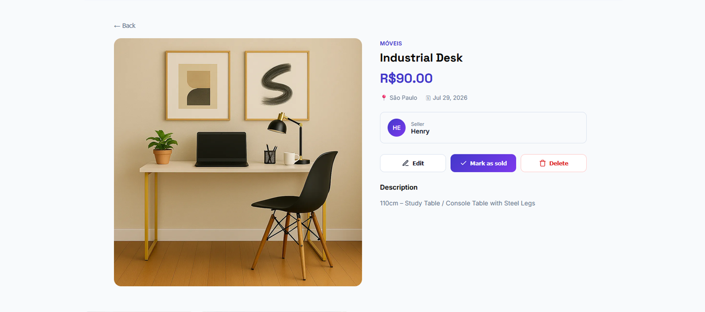
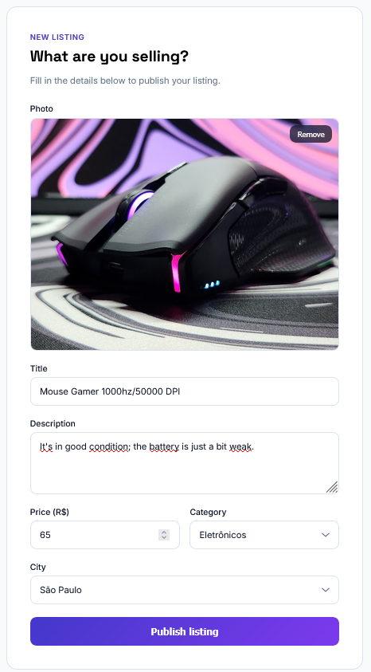
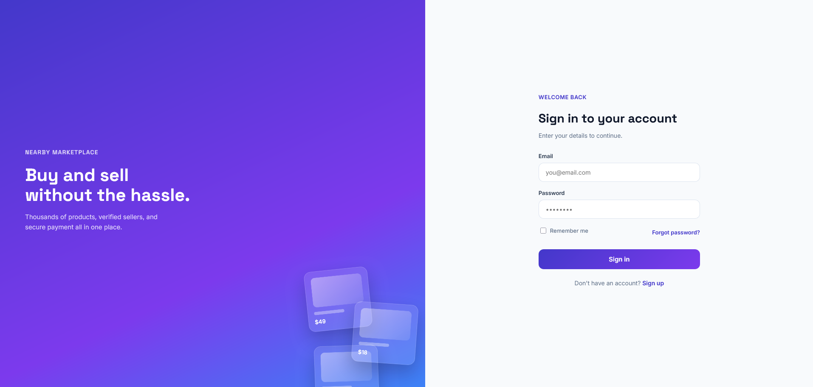
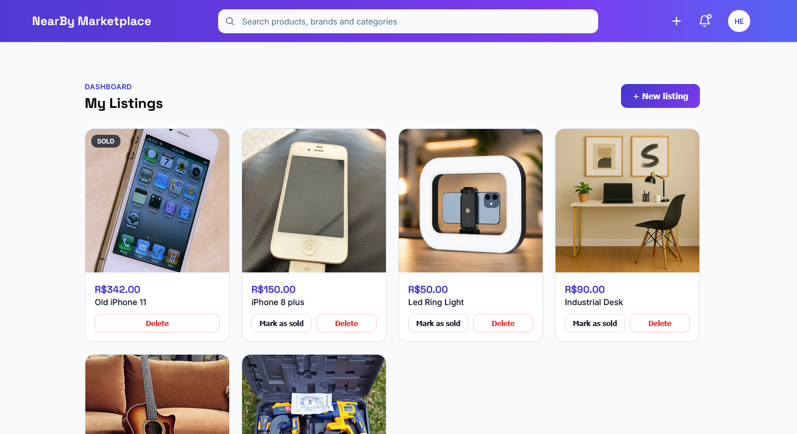

# NearBy Marketplace

A full-stack, location-aware classifieds marketplace where users can list items for sale, upload photos, and discover listings near them. Built end-to-end with **Angular** and **Spring Boot**, deployed for free across four cloud providers.

**[Live Demo](https://nearby-marketplace-peach.vercel.app)** · **[API (Render)](https://nearby-marketplace.onrender.com/api/cities)** · **[Report a Bug](../../issues)**

> ⏱️ **Note:** the backend runs on Render's free tier, which spins down after periods of inactivity. The first request after idle time may take 30–60 seconds to respond while the instance wakes up — subsequent requests are fast.

---

## Overview

NearBy Marketplace lets users create an account, publish listings with photos, and browse nearby items for sale — similar in spirit to OLX or Facebook Marketplace, built from scratch as a full-stack learning project focused on production-shaped patterns: authentication, authorization, file storage, geospatial querying, and a fully decoupled REST architecture.

## Screenshots

| Home | Listing Detail |
|---|---|
|  |  |

| Create Listing | Login |
|---|---|
|  |  |

| My Listings |
|---|
|  |

## Features

- 🔐 **Authentication** — JWT-based registration and login, with protected routes on both frontend and backend
- 📝 **Full listing CRUD** — create, view, edit, delete, and mark listings as sold
- 📸 **Image uploads** — listing photos stored in Cloudflare R2 (S3-compatible object storage)
- 📍 **Proximity search** — find listings within a radius using the Haversine formula, no paid geospatial extensions required
- 📄 **Pagination** — server-side paging on all listing queries
- 🛡️ **Ownership authorization** — only a listing's owner can edit, delete, or mark it as sold, enforced server-side regardless of what the client sends
- 🎨 **Custom design system** — no UI framework dependency; hand-built components with a consistent indigo/violet visual identity

## Tech Stack

### Frontend
| Technology | Purpose |
|---|---|
| [Angular](https://angular.dev/) (standalone components) | SPA framework |
| Angular Signals | Reactive state management |
| Reactive & Template-driven Forms | Form handling and validation |
| SCSS with CSS custom properties | Design system / theming |

### Backend
| Technology | Purpose |
|---|---|
| [Spring Boot 4](https://spring.io/projects/spring-boot) | Application framework |
| Spring Web (MVC) | REST API layer |
| Spring Data JPA / Hibernate | Persistence and repository abstraction |
| Spring Security + JWT (jjwt) | Stateless authentication |
| Flyway | Database schema migrations |
| Lombok | Boilerplate reduction |

### Infrastructure (all free-tier)
| Service | Role |
|---|---|
| [Neon](https://neon.tech) | Serverless PostgreSQL |
| [Cloudflare R2](https://developers.cloudflare.com/r2/) | S3-compatible object storage for listing images |
| [Render](https://render.com) | Backend hosting (Docker container) |
| [Vercel](https://vercel.com) | Frontend static hosting |

## Architecture

```
nearby-marketplace/
├── nearby-marketplace-backend/     # Spring Boot API
│   └── src/main/java/.../
│       ├── controller/             # REST endpoints
│       ├── service/                # Business logic & authorization
│       ├── repository/             # Spring Data JPA interfaces
│       ├── model/                  # JPA entities
│       ├── dto/                    # Request/response DTOs
│       ├── security/               # JWT filter, JWT service
│       ├── config/                 # Security & storage configuration
│       └── exception/              # Global exception handling
│
└── nearby-marketplace-frontend/    # Angular SPA
    └── src/app/
        ├── core/                   # Services, models, guards, interceptors
        ├── features/               # Route-level pages (auth, home, listings)
        └── shared/                 # Reusable components & layouts
```

The frontend and backend communicate exclusively over REST — there's no server-side rendering coupling between them, so each is deployed and scaled independently.

## Architecture Decisions

A few notable trade-offs made along the way, and why:

- **Haversine formula over PostGIS** — proximity search is implemented as a plain SQL calculation (`6371 * acos(...)`) rather than requiring a PostGIS extension. It's less precise for very large-scale geospatial workloads, but sufficient for city-level radius search and avoids adding infrastructure complexity for this project's scope.
- **Cloudflare R2 over AWS S3** — R2 offers a permanent free tier (10GB, zero egress fees) with an S3-compatible API, avoiding the risk of AWS's credit-based free tier expiring or auto-closing the account. The same AWS SDK code would work against real S3 with only an endpoint change.
- **DTOs for every request/response** — entities are never serialized directly. This avoids leaking sensitive fields (like password hashes), prevents infinite recursion from bidirectional JPA relationships, and decouples the API contract from the database schema.
- **Server-side ownership checks** — "only the owner can edit/delete" is enforced in the service layer using the authenticated principal, never trusted from client-supplied data.
- **Monorepo structure** — frontend and backend live in one repository for easier portfolio review and simpler local development, at the cost of independent deploy pipelines (a reasonable trade-off at this project's scale).
- **`spring.jpa.open-in-view=true`** — kept enabled deliberately for simplicity at this scale, aware of the trade-off (lazy-loading resolution happens implicitly during view rendering rather than being explicitly scoped to the service layer).

## API Endpoints

| Method | Endpoint | Auth required | Description |
|---|---|---|---|
| `POST` | `/api/auth/register` | No | Register a new user |
| `POST` | `/api/auth/login` | No | Authenticate and receive a JWT |
| `GET` | `/api/auth/me` | Yes | Get the authenticated user's profile |
| `GET` | `/api/cities` | No | List all cities |
| `GET` | `/api/categories` | No | List all categories |
| `GET` | `/api/listings` | No | List active listings (paginated) |
| `GET` | `/api/listings/nearby` | No | Find listings within a radius of a lat/lng point |
| `GET` | `/api/listings/mine` | Yes | List the authenticated user's own listings |
| `GET` | `/api/listings/{id}` | No | Get a single listing |
| `POST` | `/api/listings` | Yes | Create a listing |
| `PUT` | `/api/listings/{id}` | Yes (owner) | Update a listing |
| `PATCH` | `/api/listings/{id}/sold` | Yes (owner) | Mark a listing as sold |
| `DELETE` | `/api/listings/{id}` | Yes (owner) | Delete a listing |
| `POST` | `/api/listings/{id}/images` | Yes (owner) | Upload an image for a listing |

## Getting Started

### Prerequisites
- Java 21+
- Node.js 18+ and npm
- Angular CLI (`npm install -g @angular/cli`)
- A PostgreSQL database (e.g. a free [Neon](https://neon.tech) project)
- A Cloudflare R2 bucket (or any S3-compatible storage)

### Backend Setup

```bash
cd nearby-marketplace-backend
```

Set the following environment variables:

```
DB_USERNAME=your_db_username
DB_PASSWORD=your_db_password
JWT_SECRET=a_long_random_string_at_least_32_characters
R2_ACCESS_KEY=your_r2_access_key
R2_SECRET_KEY=your_r2_secret_key
R2_ENDPOINT=https://your-account-id.r2.cloudflarestorage.com
R2_PUBLIC_URL=https://pub-xxxx.r2.dev
```

Then run:

```bash
./mvnw spring-boot:run
```

The API starts on `http://localhost:8080`. Flyway migrations run automatically on startup.

### Frontend Setup

```bash
cd nearby-marketplace-frontend
npm install
ng serve
```

The app runs on `http://localhost:4200`.

## Deployment

This project is deployed as two independent, freely-hosted services:

- **Backend**: Dockerized Spring Boot app on [Render](https://render.com) (free tier)
- **Database**: [Neon](https://neon.tech) serverless PostgreSQL (free tier)
- **Image storage**: [Cloudflare R2](https://developers.cloudflare.com/r2/) (free tier, 10GB)
- **Frontend**: Static build on [Vercel](https://vercel.com) (free tier)

## Roadmap

- [ ] In-app messaging between buyer and seller (WebSockets)
- [ ] Delete/replace individual listing images without deleting the whole listing
- [ ] Location-based search UI on the frontend (currently backend-only)
- [ ] Unit and integration tests (JUnit / Jasmine)
- [ ] Favorite/save listings

## License

This project is licensed under the [MIT License](LICENSE).

## Author

**Henrique Selau de Oliveira**
[LinkedIn](#) · [GitHub](#) · [Portfolio](#)
